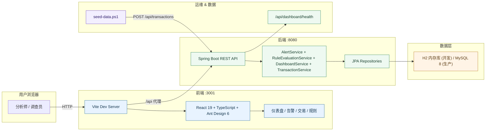
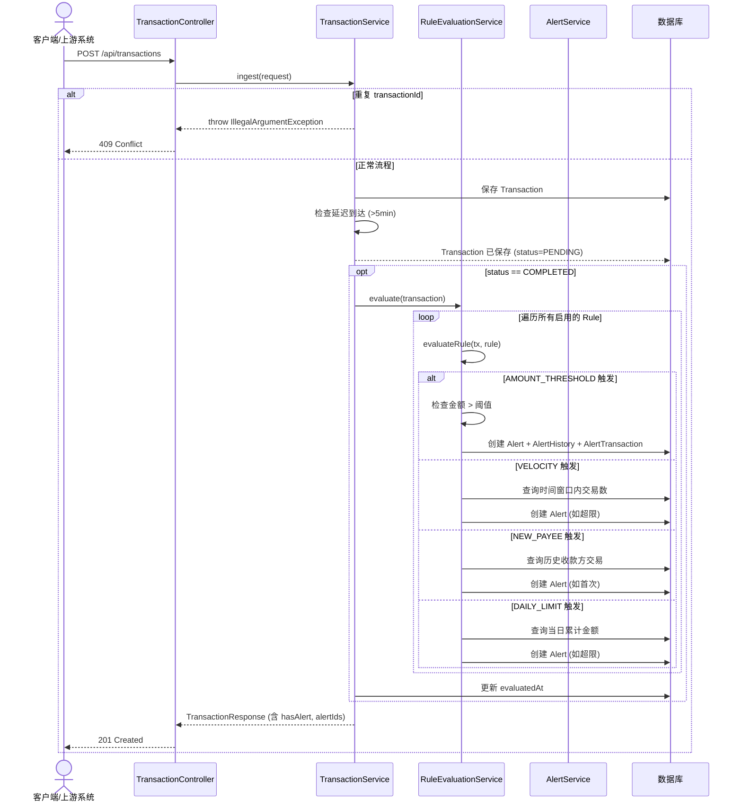
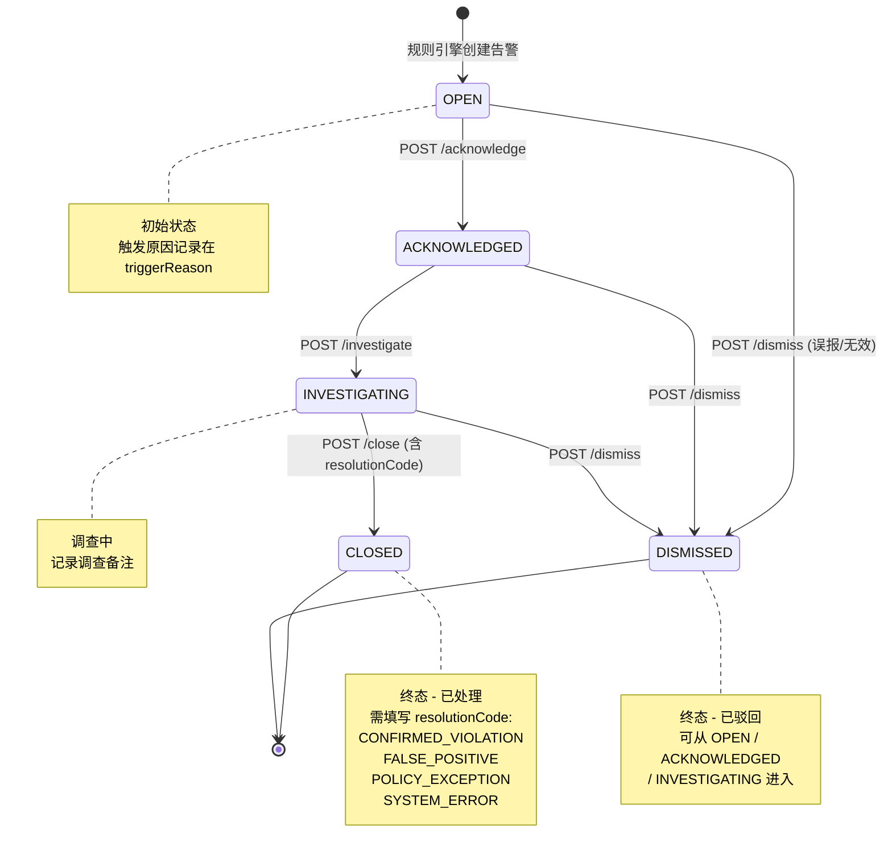

# FRAML 交易监控系统 (Transaction Monitoring System)

## 1. 项目简介

FRAML 交易监控系统是一个全栈实时交易监控与告警平台，融合 **欺诈检测 (Fraud)** 与 **反洗钱 (AML)** 能力，为金融机构提供交易风险识别、告警生命周期管理和规则治理的一站式解决方案。

核心能力：

- **实时规则引擎**：交易入库时自动评估，支持金额阈值、频率、新收款方、日累计四种规则类型
- **风险校准**：规则阈值结合风险评分动态计算，支持按交易类型、币种精细化过滤
- **告警去重与关联**：同一交易多次触发自动合并，避免告警风暴
- **完整告警生命周期**：OPEN → ACKNOWLEDGED → INVESTIGATING → CLOSED / DISMISSED，含状态历史审计追踪
- **规则治理**：规则版本化、启用/停用切换、变更日志记录

---

## 2. 功能列表

### 仪表盘 (Dashboard)
- KPI 卡片：当前未处理告警、调查中告警、今日告警数、高风险告警、今日交易量、告警率
- 7 日告警趋势柱状图（按严重程度堆叠）
- 告警严重程度分布（HIGH / MEDIUM / LOW）
- 近 7 日触发次数最多的规则排名
- 一键导航至告警列表和交易列表

### 风险告警 (Risk Alerts)
- 分页告警表格，支持状态、严重程度、关键字筛选
- 点击侧边抽屉查看告警详情与状态历史时间线
- 独立告警详情页，包含调查面板
- 告警生命周期操作：确认 (Acknowledge) → 调查 (Investigate) → 关闭 (Close) / 驳回 (Dismiss)
- 不可逆操作需二次确认，支持乐观锁版本检查

### 交易管理 (Transactions)
- 分页交易目录，支持账户、收款方、状态、类型、关键字、时间范围过滤
- 交易详情弹窗，展示关联告警信息
- 支持从交易深度链接至关联告警
- 交易状态更新（PENDING → COMPLETED / FAILED / CANCELLED / REVERSED）
- 延迟到达检测（交易时间与接收时间差 > 5 分钟标记为 late arrival）

### 监控规则 (Monitoring Rules)
- 查看全部已配置规则
- 创建 / 编辑 / 删除规则
- 一键启用/停用规则
- 支持四种规则类型：
  | 类型 | 说明 |
  |------|------|
  | **AMOUNT_THRESHOLD** | 单笔交易金额超过阈值时告警 |
  | **VELOCITY** | N 分钟内交易笔数超过上限时告警 |
  | **NEW_PAYEE** | 首次向新收款方交易时告警 |
  | **DAILY_LIMIT** | 日累计交易金额超过上限时告警 |

### 双向链接 (Bidirectional Linking)
- 交易详情展示关联告警列表
- 告警详情展示关联交易列表
- 支持从交易直接跳转至告警详情，反之亦然

---

## 3. 技术栈

| 层级 | 技术 | 版本 |
|------|------|------|
| **前端框架** | React + TypeScript | React 19 + TS 6.0 |
| **构建工具** | Vite | 8.x |
| **UI 组件库** | Ant Design | 6.5 |
| **图表** | @ant-design/charts | 2.6 |
| **路由** | React Router DOM | 7.x |
| **HTTP 客户端** | Axios | 1.x |
| **后端框架** | Spring Boot | 3.2.5 |
| **语言** | Java | 17 |
| **持久层** | Spring Data JPA (Hibernate) | — |
| **API 文档** | SpringDoc OpenAPI (Swagger UI) | 2.5.0 |
| **数据库** | MySQL 8.x（生产）/ H2（开发内存库） | — |
| **构建工具** | Maven | 3.9+ |
| **代码简化** | Lombok | 1.18.38 |

---

## 4. 启动说明

### 前置条件

- Java 17+
- Maven 3.9+
- Node.js 18+
- MySQL 8.x（或使用内置 H2 内存数据库快速启动）

### 快速开始（使用 H2 内存数据库）

默认配置已启用 H2 内存数据库，无需安装 MySQL 即可启动后端：

```bash
# 1. 启动后端
cd backend
mvn spring-boot:run
```

后端启动后：
- API 地址：`http://localhost:8080`
- Swagger UI：`http://localhost:8080/swagger-ui.html`
- H2 控制台：`http://localhost:8080/h2-console`（JDBC URL: `jdbc:h2:mem:transaction_monitoring`，用户名 `sa`，空密码）

```bash
# 2. 启动前端
cd ui
npm install
npm run dev
```

前端启动后：`http://localhost:3001`

### 使用 MySQL

如需切换到 MySQL，修改 `backend/src/main/resources/application.yml`：

```yaml
spring:
  datasource:
    url: jdbc:mysql://localhost:3306/transaction_monitoring?useSSL=false&allowPublicKeyRetrieval=true&serverTimezone=UTC
    username: root
    password: your_password
    driver-class-name: com.mysql.cj.jdbc.Driver
  jpa:
    properties:
      hibernate:
        dialect: org.hibernate.dialect.MySQLDialect
```

先创建数据库：
```sql
CREATE DATABASE IF NOT EXISTS transaction_monitoring CHARACTER SET utf8mb4;
```

### 模拟数据填充

使用 PowerShell 脚本快速填充测试数据：

```powershell
.\seed-data.ps1
```

该脚本会创建覆盖所有四种规则类型的模拟交易和告警，方便前端演示。

---

## 5. 当前架构图



**运行时端口：**

| 组件 | 端口 |
|------|------|
| 前端 (Vite Dev Server) | 3001 |
| 后端 (Spring Boot) | 8080 |
| 数据库 (MySQL) | 3306 |

**通信方式：** 前端通过 Vite 开发代理将 `/api` 请求转发至后端 `localhost:8080`，生产环境建议使用 Nginx 反向代理。

---

## 6. 交易处理时序图



**关键设计决策：**
- 规则评估在 `REQUIRES_NEW` 事务中执行，确保单条规则失败不影响其他规则评估
- PENDING 状态的交易不会被评估，仅 COMPLETED 交易触发规则引擎
- 告警 ID 格式：`ALT-{年份}-{序号}`

---

## 7. 告警状态图



**状态转换规则：**
- 每次状态变更记录 `AlertHistory`（fromStatus → toStatus）
- 支持乐观锁：请求可携带 `expectedStatus` 和 `expectedVersion` 防止并发冲突
- CLOSED 和 DISMISSED 为终态，不可再变更
- CLOSED 只能从 INVESTIGATING 进入；DISMISSED 可从任意非终态进入

---

## 8. REST API 与 Swagger 入口

### Swagger UI

启动后端后访问：**http://localhost:8080/swagger-ui.html**

OpenAPI JSON：**http://localhost:8080/api-docs**

### 完整 API 列表

| 方法 | 路径 | 说明 |
|------|------|------|
| **交易 (Transactions)** | | |
| `POST` | `/api/transactions` | 录入交易并触发规则评估 |
| `GET` | `/api/transactions` | 分页搜索交易列表 |
| `GET` | `/api/transactions/{id}` | 获取交易详情（含关联告警） |
| `PATCH` | `/api/transactions/{id}/status` | 更新交易状态 |
| **告警 (Alerts)** | | |
| `GET` | `/api/alerts` | 分页搜索告警列表 |
| `GET` | `/api/alerts/{id}` | 获取告警详情（含状态历史 + 关联交易） |
| `POST` | `/api/alerts/{id}/acknowledge` | 确认告警 |
| `POST` | `/api/alerts/{id}/investigate` | 开始调查 |
| `POST` | `/api/alerts/{id}/close` | 关闭告警（需 resolutionCode） |
| `POST` | `/api/alerts/{id}/dismiss` | 驳回告警（需 resolutionCode） |
| **规则 (Rules)** | | |
| `GET` | `/api/rules` | 获取全部规则 |
| `GET` | `/api/rules/{id}` | 获取单个规则 |
| `POST` | `/api/rules` | 创建规则 |
| `PUT` | `/api/rules/{id}` | 更新规则 |
| `PATCH` | `/api/rules/{id}/toggle` | 切换规则启用/停用 |
| `DELETE` | `/api/rules/{id}` | 删除规则 |
| **仪表盘 (Dashboard)** | | |
| `GET` | `/api/dashboard/summary` | 获取仪表盘 KPI 汇总数据 |
| `GET` | `/api/dashboard/health` | 健康检查 |

### 示例请求

```bash
# 录入一笔大额交易（将触发 AMOUNT_THRESHOLD 规则）
curl -X POST http://localhost:8080/api/transactions \
  -H "Content-Type: application/json" \
  -d '{
    "transactionId": "TXN-DEMO-001",
    "accountId": "ACC-100",
    "payeeId": "PAYEE-200",
    "payeeName": "Acme Corp",
    "type": "DEBIT",
    "amount": 15000.00,
    "currency": "USD",
    "status": "COMPLETED",
    "transactionTime": "2026-07-28T10:00:00Z",
    "paymentChannel": "WIRE",
    "country": "US",
    "description": "Supplier payment"
  }'
```

---

## 9. 测试策略

### 当前状态

项目目前处于 **功能快速迭代阶段**，核心业务逻辑已实现并通过手动验证。自动化测试框架已配置就绪（`spring-boot-starter-test` 已引入），测试用例正在补充中。

### 计划中的测试分层

```
┌─────────────────────────────────┐
│        E2E Tests                │  ← Playwright / Cypress
│   (完整用户流程验证)              │
├─────────────────────────────────┤
│     Integration Tests           │  ← Spring Boot Test + MockMvc
│   (API 契约 + 数据库交互)         │
├─────────────────────────────────┤
│      Unit Tests                 │  ← JUnit 5 + Mockito
│   (规则引擎 + 服务逻辑)            │
└─────────────────────────────────┘
```

### 各层测试计划

| 层级 | 工具 | 范围 | 优先级 |
|------|------|------|--------|
| **单元测试** | JUnit 5 + Mockito | RuleEvaluationService 规则逻辑、AlertService 状态转换、TransactionService 重复检测 | 🔴 高 |
| **集成测试** | SpringBootTest + MockMvc | 所有 REST 端点契约、JPA 查询正确性、乐观锁并发场景 | 🔴 高 |
| **E2E 测试** | Playwright | 仪表盘加载 → 交易录入 → 告警生成 → 告警处理完整流程 | 🟡 中 |
| **性能测试** | JMeter / k6 | 交易录入吞吐量、规则评估延迟、并发告警操作 | 🟢 低 |

### 关键测试场景

- [ ] `RuleEvaluationService` — 四种规则类型各自触发/不触发边界条件
- [ ] `AlertService` — 合法状态转换成功、非法转换被拒绝、版本冲突检测
- [ ] `TransactionService.ingest()` — 重复交易拒绝、延迟到达标记
- [ ] `AlertController` — 各端点 HTTP 状态码正确性
- [ ] 并发测试 — 同一告警同时被两个用户操作，乐观锁生效

---

## 10. 最新测试覆盖率及截图

> ⚠️ **当前测试覆盖率：待补充**
>
> 项目处于快速开发阶段，自动化测试用例正在编写中。以下为计划达成的覆盖率目标：

| 指标 | 目标 | 当前 |
|------|------|------|
| 行覆盖率 | ≥ 80% | — |
| 分支覆盖率 | ≥ 70% | — |
| 方法覆盖率 | ≥ 85% | — |

后续将在 CI 流水线中集成 JaCoCo 覆盖率报告，并在此处展示最新覆盖率截图。

---

## 11. Git 分支策略及分支图

### 分支策略

```
main (稳定分支)
  │
  ├── 禁止直接提交，仅通过 Pull Request 合并
  ├── 每个 PR 需至少一位团队成员 Code Review
  └── 合并后自动触发部署（待配置 CI/CD）
      │
feature/* (功能分支)
  │
  ├── 所有新功能、Bug 修复在 feature 分支上进行
  ├── 命名规范: feature/<功能简述> (如 feature/link, feature-dashboard)
  └── 完成后提交 PR 合并至 main
```

### Git 分支图

```
* 959fb8a feat: transaction-alert bidirectional linking        ← feature/link (当前)
*   998d8d8 Merge pull request #3 (feature-dashboard)
|\
| * 182d91b Improve dashboard layout and seed demo data
* | 18d2dae docs: add architecture diagram
* |   7d4c3bb Merge pull request #2 (feature/package)
|\ \
| * | 2bd0a68 chore: move PRD/spec docs into prd/ directory
| * | 3c10e82 docs: update README to reflect actual stack
* | | fa9f2d5 docs(adr): add architecture and ownership decision
|/ /
* |   532230a Merge pull request #1 (feature/addTransaction)
|\ \
| * | 0079e58 fix: remove redundant currency column
| * | f8ae718 feat: add create transaction functionality
* | 47ba880 fix(ui): tune typography and responsive layout
* | c9b27e5 feat(ui): third-round monitoring polish
* | 88ce42a feat(ui): second-round premium dashboard and alert detail
* | 90fb88d style: polish frontend with premium visual theme
|/
* db69a94 feat: add full-stack implementation
* 3ad08c6 Upload transaction monitoring documents
```

### 当前分支

| 分支 | 说明 |
|------|------|
| `main` | 稳定主干 |
| `feature/link` | 当前活跃分支 — 交易-告警双向链接功能 |

### 提交规范

- `feat:` — 新功能
- `fix:` — Bug 修复
- `docs:` — 文档变更
- `style:` — UI/样式调整
- `chore:` — 工程化/构建变更
- `refactor:` — 代码重构
- `test:` — 测试相关

---

## 12. ADR 索引

| ADR | 标题 | 状态 | 日期 |
|-----|------|------|------|
| [ADR-0001](docs/adr/0001-architecture-stack-and-code-ownership.md) | 架构技术栈与代码所有权 | ✅ Accepted | 2026-07-28 |

### ADR-0001 摘要

- **技术栈标准化**：前端 React + TypeScript + Vite + Ant Design，后端 Spring Boot + Java 17，数据库 MySQL 8
- **四位代码所有者**：lele, julie, ommen, lucas
- **审查规则**：架构变更需至少 2 位所有者审查；UI 设计系统变更需至少 1 位前端负责人审查；API 契约变更需至少 1 位后端负责人审查
- **未来 ADR** 应添加至 `docs/adr/` 目录，按序号递增命名

---

## 13. 团队成员与贡献

| 成员 | 角色 | 主要贡献领域 |
|------|------|-------------|
| **lele** | 代码所有者 | 架构决策、前后端核心逻辑 |
| **julie** | 代码所有者 | 架构决策、UI/UX 设计 |
| **ommen** | 代码所有者 | 架构决策、API 设计 |
| **lucas** | 代码所有者 | 架构决策、后端领域逻辑 |

### 贡献方式

1. 从 `main` 分支创建 `feature/<功能名>` 分支
2. 开发完成后提交 Pull Request
3. PR 需至少一位团队成员 Code Review 通过
4. 合并至 `main` 后删除功能分支

---

## 14. 已知限制

| 限制 | 说明 | 影响 | 计划 |
|------|------|------|------|
| **无自动化测试** | 项目尚未编写单元/集成测试用例 | 回归风险较高，手动验证耗时 | 下一迭代优先补充 RuleEvaluationService 和 AlertService 测试 |
| **H2 默认数据库** | 开发环境使用 H2 内存库，MySQL 方言兼容性未完全验证 | 部分 JPA 查询在 MySQL 上可能有语法差异 | 引入 TestContainers 进行数据库兼容性测试 |
| **无认证/授权** | API 端点无访问控制 | 仅适合开发/演示环境，不可直接用于生产 | 集成 Spring Security + JWT |
| **无分页游标** | 列表分页使用传统 offset/page 方式 | 大数据量下深分页性能下降 | 后续切换为 keyset cursor 分页 |
| **无 CI/CD** | 缺少持续集成/部署流水线 | 代码质量检查、测试、部署需手动执行 | 配置 GitHub Actions |
| **单实例运行** | 不支持水平扩展 | 并发量受限 | 引入 Redis 缓存、数据库读写分离 |
| **规则引擎无热加载** | 规则变更需重启应用生效 | 生产环境规则调整不灵活 | 引入规则缓存 + 定时刷新机制 |
| **前端无状态管理库** | 未使用 Zustand/Redux | 组件间状态传递依赖 props 和 API 重取 | 按需引入轻量状态管理 |
| **告警通知缺失** | 无邮件/消息通知机制 | 告警生成后分析人员无主动提醒 | 集成消息队列 + 通知服务 |

---

## 15. 后续计划

### 短期（1-2 周）

- [ ] 编写 `RuleEvaluationService` 单元测试，覆盖四种规则类型的触发/不触发边界
- [ ] 编写 `AlertService` 单元测试，覆盖状态机转换和乐观锁
- [ ] 编写 `TransactionService` 单元测试，覆盖重复检测和延迟到达
- [ ] 编写 API 集成测试（MockMvc），验证 HTTP 状态码和响应结构
- [ ] 集成 JaCoCo 生成覆盖率报告

### 中期（1-2 月）

- [ ] 集成 Spring Security + JWT 实现认证鉴权
- [ ] 引入 TestContainers 进行 MySQL 兼容性测试
- [ ] 配置 GitHub Actions CI 流水线（编译 → 测试 → 覆盖率检查）
- [ ] 前端引入 Zustand 状态管理
- [ ] 实现 keyset cursor 分页替代 offset 分页
- [ ] 规则引擎支持热加载（定时刷新 + 缓存）

### 长期（3-6 月）

- [ ] 引入 Redis 缓存 Dashboard 查询结果，提升仪表盘加载性能
- [ ] 数据库读写分离，支持更高并发
- [ ] 告警通知服务（邮件/短信/Webhook）
- [ ] 告警聚合与关联分析（跨账户、跨规则模式识别）
- [ ] 引入 Apache Kafka 实现交易异步处理，削峰填谷
- [ ] E2E 测试套件（Playwright）
- [ ] 性能测试基准建立与持续监控
- [ ] 生产环境 Docker Compose / Kubernetes 部署方案

---

## 项目结构

```
404NOTFOUND/
├── backend/                          # Spring Boot 后端
│   ├── pom.xml                       # Maven 配置
│   └── src/main/java/com/framl/monitoring/
│       ├── TransactionMonitoringApplication.java  # 启动类
│       ├── config/
│       │   ├── CorsConfig.java       # CORS 跨域配置
│       │   └── DataInitializer.java  # 默认规则 & 示例数据初始化
│       ├── controller/
│       │   ├── AlertController.java      # 告警 API
│       │   ├── DashboardController.java  # 仪表盘 API
│       │   ├── RuleController.java       # 规则 CRUD API
│       │   └── TransactionController.java # 交易 API
│       ├── dto/                      # 请求/响应 DTO
│       ├── entity/                   # JPA 实体
│       │   ├── Alert.java
│       │   ├── AlertHistory.java
│       │   ├── AlertTransaction.java
│       │   ├── Rule.java
│       │   └── Transaction.java
│       ├── enums/                    # 枚举类型
│       ├── repository/               # Spring Data 仓库
│       └── service/                  # 业务逻辑
│           ├── AlertService.java
│           ├── DashboardService.java
│           ├── RuleEvaluationService.java  # 规则引擎核心
│           ├── RuleService.java
│           └── TransactionService.java
├── ui/                               # React 前端
│   ├── package.json
│   ├── vite.config.ts
│   └── src/
│       ├── api/                      # Axios API 客户端
│       ├── pages/                    # 页面组件
│       │   ├── Dashboard.tsx         # 仪表盘
│       │   ├── AlertsList.tsx        # 告警列表
│       │   ├── AlertDetail.tsx       # 告警详情
│       │   ├── TransactionsList.tsx  # 交易列表
│       │   ├── TransactionDetail.tsx # 交易详情
│       │   └── RulesList.tsx         # 规则管理
│       ├── types/                    # TypeScript 类型
│       └── utils/                    # 工具函数
├── docs/
│   ├── adr/                          # 架构决策记录
│   └── architecture/                 # 架构图文档
├── prd/                              # 产品需求文档
│   ├── TM_Complete_Requirements_v3.0.docx
│   ├── TM_OpenAPI_By_Page_v3.0.yaml
│   ├── TM_MySQL8_v3.0.sql
│   └── TM_Seed_Rules_v3.0.json
├── "Frontend prototype"/             # 前端原型 (参考)
├── seed-data.ps1                     # 模拟数据填充脚本
├── SETUP.md                          # 详细安装说明
└── README.md                         # 本文件
```

---

## 许可证

本项目为内部学习/演示项目，未设定开源许可证。
