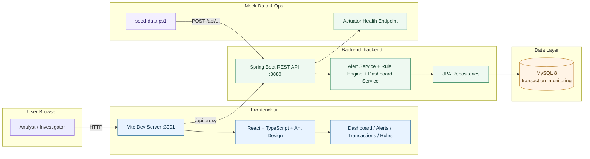

# Architecture Diagram

This diagram reflects the current implemented stack in this repository: React + Vite frontend, Spring Boot backend, and MySQL database.

## Runtime Ports

- Frontend: 3001
- Backend: 8080
- Database: 3306 (MySQL default)

## Notes

- Frontend calls backend through Vite proxy on path /api.
- Alert lifecycle actions and rule evaluation are processed in backend services.
- MySQL is the system of record for transactions, alerts, rules, and status history.
