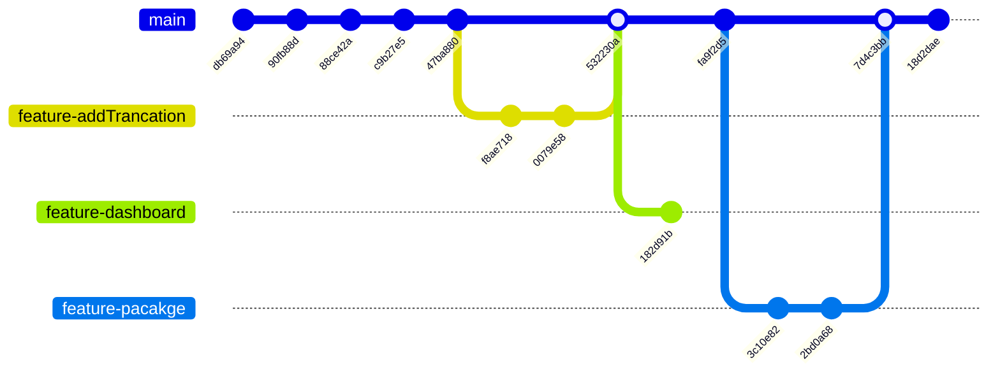

# Git Branch Graph

Generated from repository history on 2026-07-28.

## Branches

- main
- origin/main
- origin/feature-dashboard
- origin/feature

## Commit Graph (source of truth)

```text
* 18d2dae (HEAD -> main, origin/main, origin/HEAD) docs: add architecture diagram
*   7d4c3bb Merge pull request #2 from Neueda-Learning/feature/pacakge
|\
| * 2bd0a68 chore: move PRD/spec docs into prd/ directory
| * 3c10e82 docs: update README to reflect actual React/Spring Boot/MySQL stack
* | fa9f2d5 docs(adr): add architecture and ownership decision
|/
*   532230a Merge pull request #1 from Neueda-Learning/feature/addTrancation
|\
| * 0079e58 fix: remove redundant currency column from transactions table
| * f8ae718 feat: add create transaction functionality to transactions page
| | * 182d91b (origin/feature-dashboard) Improve dashboard layout and seed demo data
| |/
|/
* 47ba880 fix(ui): tune typography and responsive layout readability
* c9b27e5 feat(ui): third-round monitoring polish for status, density, and mobile detail
* 88ce42a feat(ui): second-round premium dashboard and alert detail polish
* 90fb88d style: polish frontend with premium visual theme
* db69a94 feat: add full-stack implementation - React frontend + Spring Boot backend + MySQL
```

## Mermaid Branch Diagram (high-level)



## How to Regenerate

Run in the repository root:

```powershell
git log --oneline --decorate --graph --all -n 60
```
