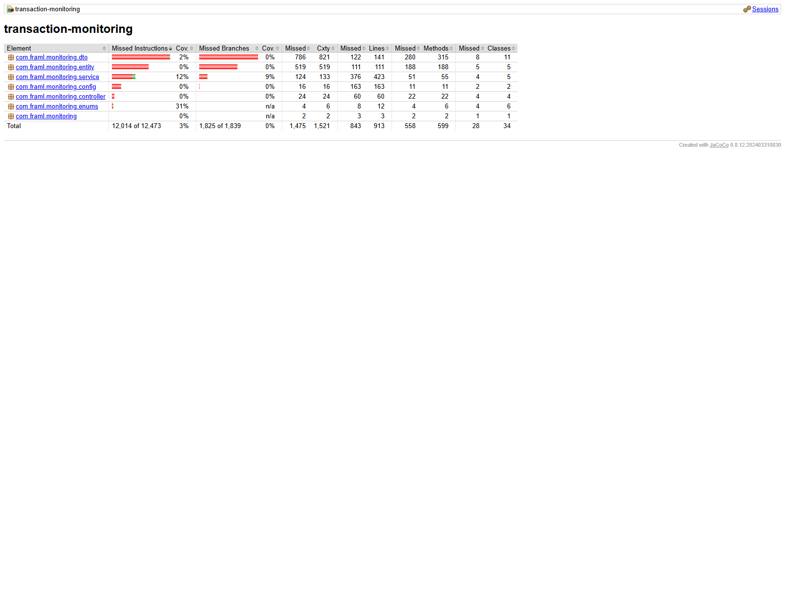
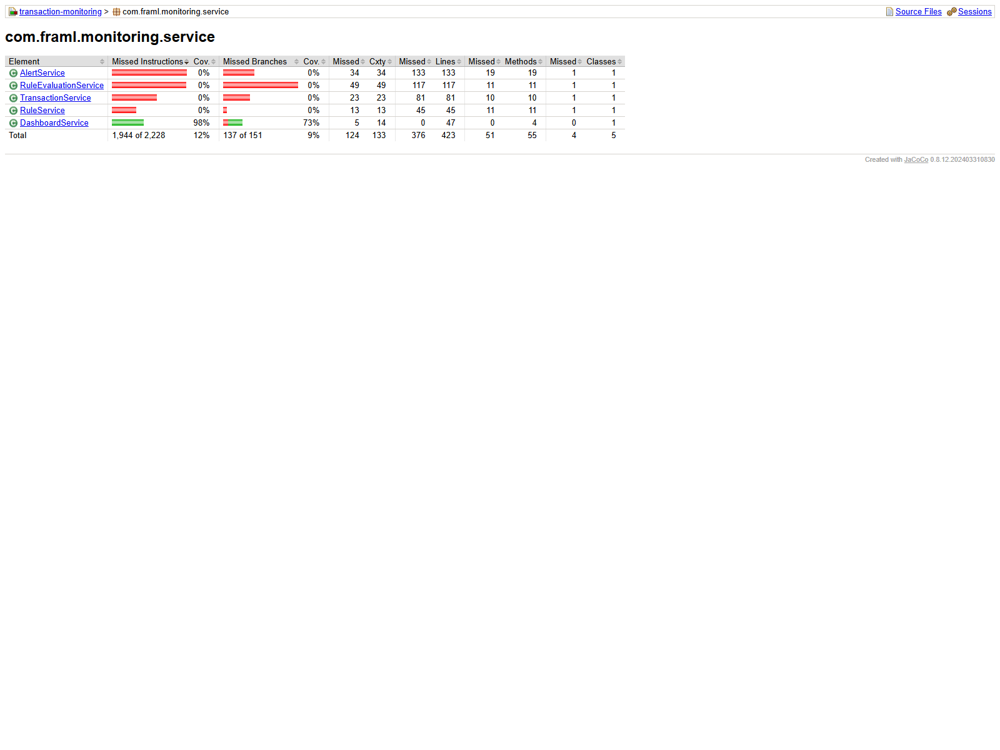
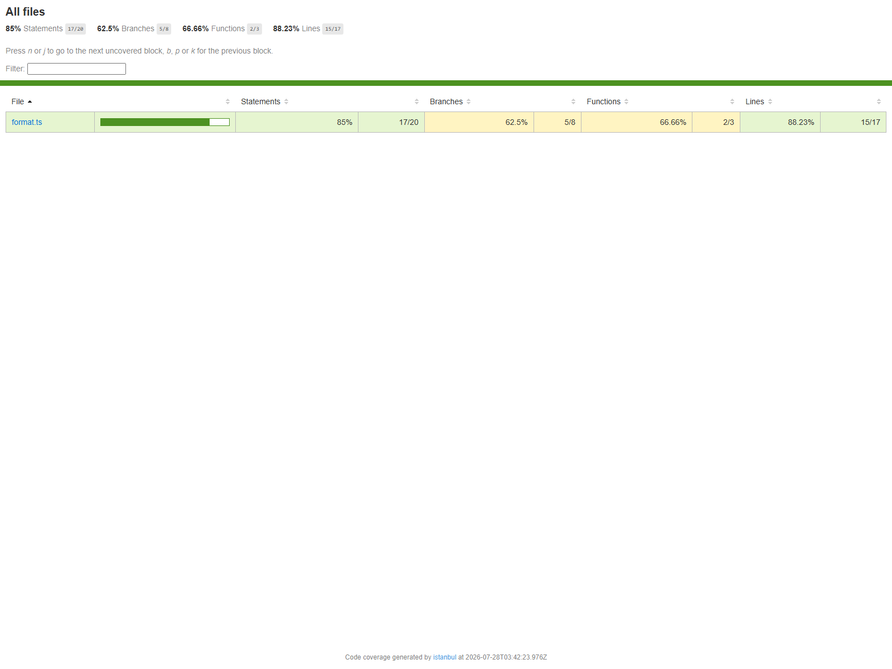
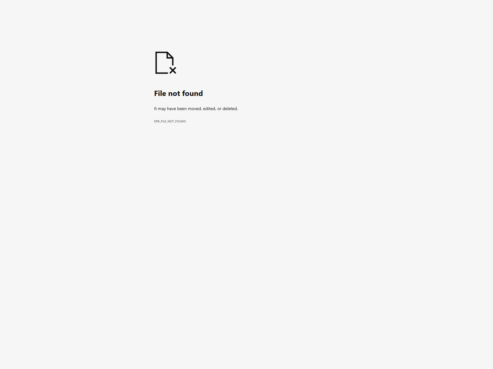

# Test Coverage Report

Date: 2026-07-28

## Scope

Coverage in this report is generated from:

- Backend unit tests using Maven + JaCoCo
- Frontend unit tests using Vitest + V8 coverage

## Commands Used

```powershell
mvn -f backend/pom.xml test
npm --prefix ui run test:coverage
```

## Backend Coverage Summary (JaCoCo)

- Instruction coverage: 3.68%
- Branch coverage: 0.76%
- Method coverage: 6.84%

## Frontend Coverage Summary (Vitest)

- Statements: 85.00%
- Branches: 62.50%
- Functions: 66.66%
- Lines: 88.23%

## Coverage Report Locations

- Backend HTML report: `backend/target/site/jacoco/index.html`
- Frontend HTML report: `ui/coverage/index.html`

## Screenshots

### 1) Backend Coverage Overview (JaCoCo)



### 2) Backend Service Package Detail (JaCoCo)



### 3) Frontend Coverage Overview (Vitest)



### 4) Frontend File Detail: format.ts (Vitest)



## Notes

- Backend coverage is currently low because only baseline tests were added in this iteration.
- Frontend coverage currently targets `src/utils/format.ts` to establish a stable test framework baseline.
